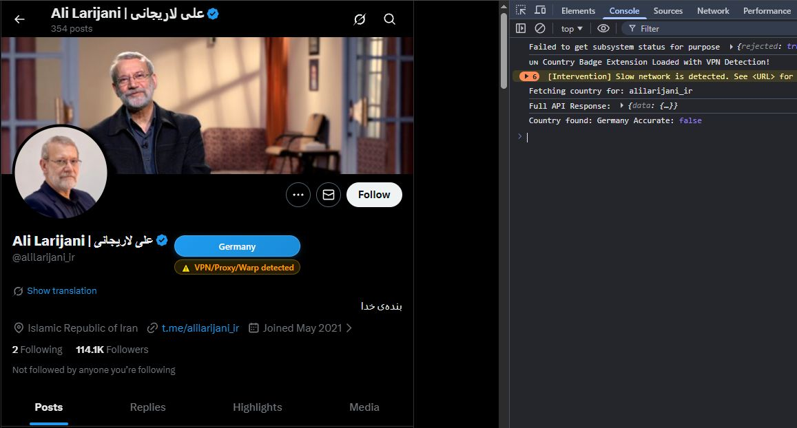
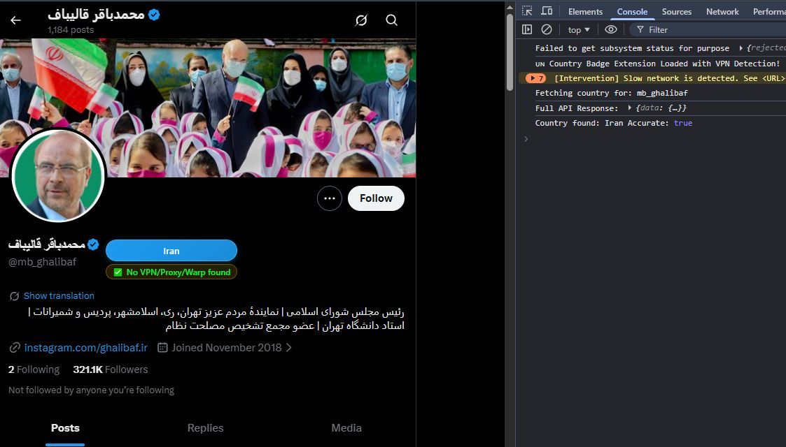

# 🇺🇳 X (Twitter) Country Badge Extension with VPN Detection

---

This project was created in response to the government’s distribution of so-called “white SIM cards”, which effectively ignored and bypassed Iranian citizens’ right to free and equal access to the internet.

By enabling clearer visibility into whether accounts are connecting from Iran, this project aims to restore a level of transparency and accountability, making it easier to understand who is genuinely operating from within the country despite imposed restrictions.

read also:
- https://fa.wikipedia.org/wiki/%D8%B3%DB%8C%D9%85%E2%80%8C%DA%A9%D8%A7%D8%B1%D8%AA_%D8%B3%D9%81%DB%8C%D8%AF
- https://www.iranintl.com/en/202511248487?source=share-link

---

A lightweight Chrome extension that detects and displays the **account-based country** of an X (Twitter) profile directly on the profile page — with **VPN / Proxy / Warp detection** support.

---




## ✨ Features

- 🌍 Detects the user's **country** from X internal GraphQL APIs  
- 🚦 Shows **VPN / Proxy / Warp detection** status  
- 🏳️ Displays **country flag emojis** automatically  
- 🔄 Smart fallback:
  - Uses profile API
  - Falls back to profile location field
  - Scans bio text if needed
- ⚡ Uses MutationObserver to work with X dynamic navigation
- 🧠 Prevents duplicate fetches per profile
- 🎨 Clean, animated UI badge injected into profile header

---

## 🖼 Preview

The badge appears directly under the username on profile pages and includes:

- Country name + flag  
- VPN status indicator (✅ or ⚠️)

---

## 🛠 How It Works

1. Extracts the username from the current `x.com/{username}` URL  
2. Fetches profile data using X's internal GraphQL API  
3. Reads:
   - `about_profile.account_based_in`
   - `about_profile.location_accurate`
4. Injects a styled badge into the DOM  
5. Observes page mutations to support SPA navigation

---

## 📦 Installation (Developer Mode)

1. Clone or download this repository
2. Open Chrome and go to:  
   ```
   chrome://extensions
   ```
3. Enable **Developer mode**
4. Click **Load unpacked**
5. Select the extension directory

---

## 🔐 Permissions Required

- `cookies` – to access CSRF token
- `storage` – token storage
- `https://x.com/*` – profile access
- `background` messaging for token retrieval

---

## 🧩 Files Overview

```
├── content.js        # Main logic (badge injection & detection)
├── background.js     # Token extraction (Bearer & CSRF)
├── manifest.json     # Extension configuration
└── README.md
```

---

## 🌐 Supported Countries

Includes automatic flag detection for 40+ countries such as:

Iran 🇮🇷 | USA 🇺🇸 | UK 🇬🇧 | Germany 🇩🇪 | France 🇫🇷 | Turkey 🇹🇷 | UAE 🇦🇪 | Japan 🇯🇵 | Canada 🇨🇦 | Australia 🇦🇺  
…and more (with partial text matching).

Unknown locations fall back to 🏴.

---

## ⚠️ Disclaimer

- This extension is **not affiliated with X (Twitter)**.
- Uses **undocumented internal APIs** which may change at any time.
- For educational and research purposes.

---


## 📄 License

MIT License – free to use, modify, and distribute.

---

## 🤝 Contributing

Pull requests are welcome.  
If you want to add:
- More countries
- Better heuristics
- Firefox support  

Feel free to contribute 🚀

---

## ❤️ Credits

Built with care for OSINT, researchers, and power users.

author: <a href="https://ali-sharify.ir">@alisharify7</a>